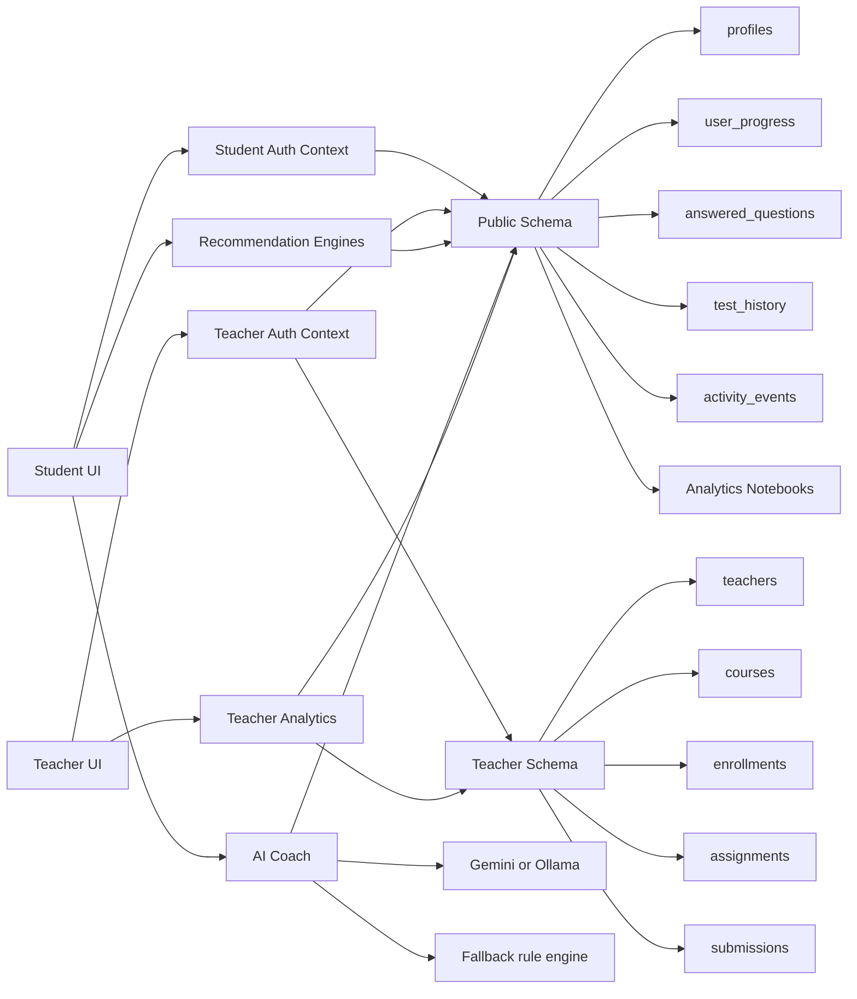
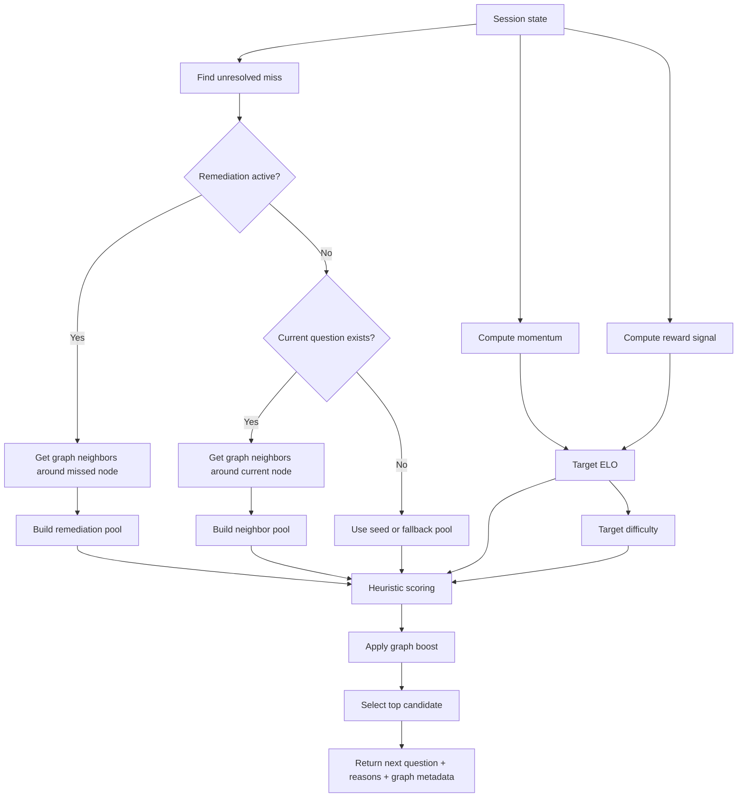
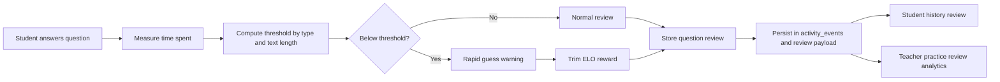
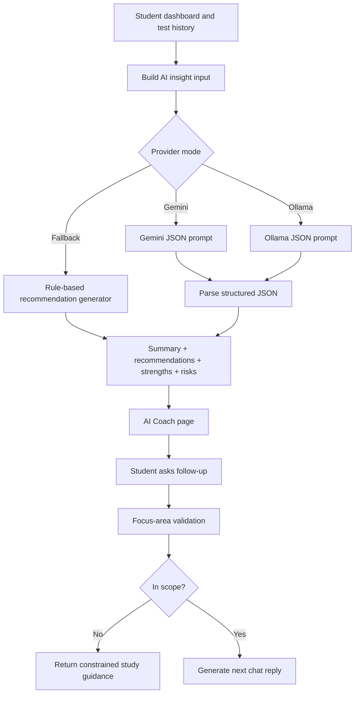
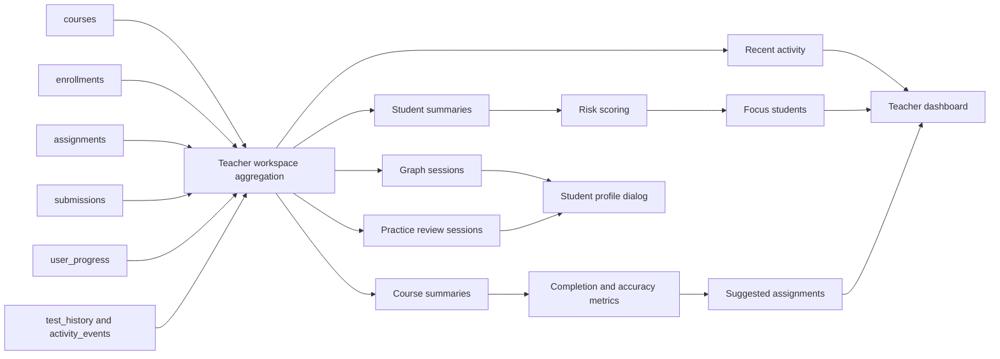
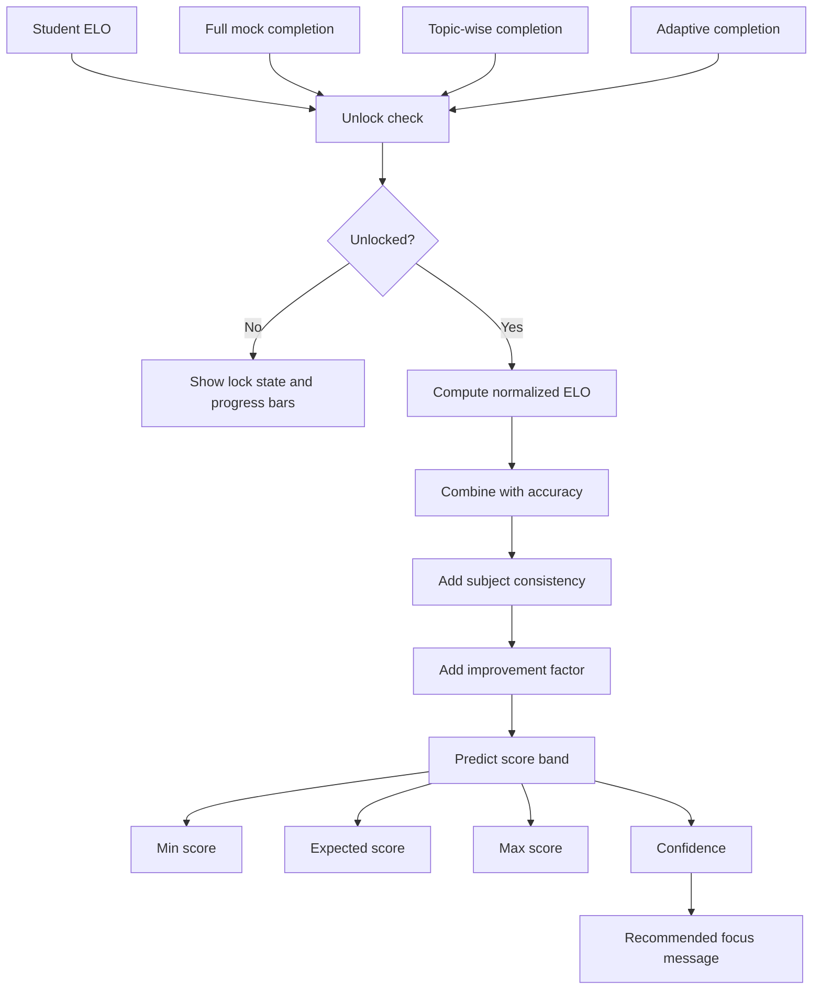
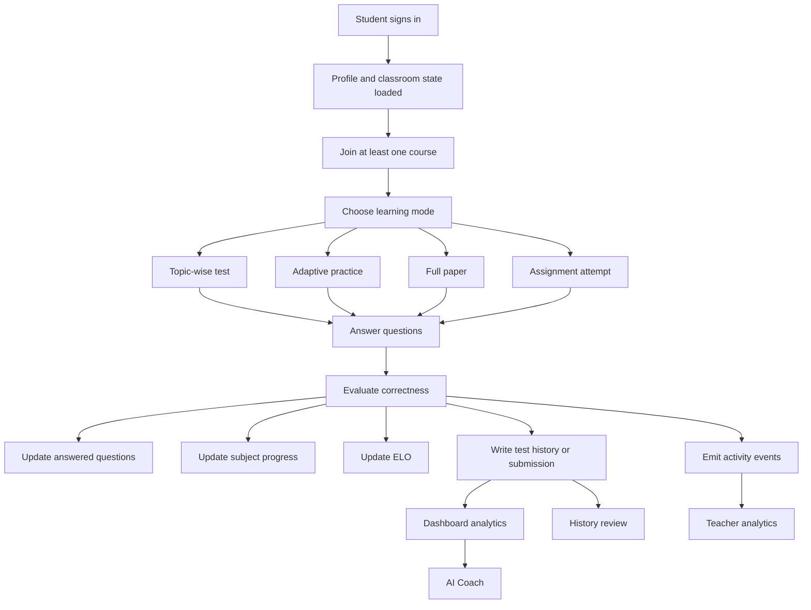
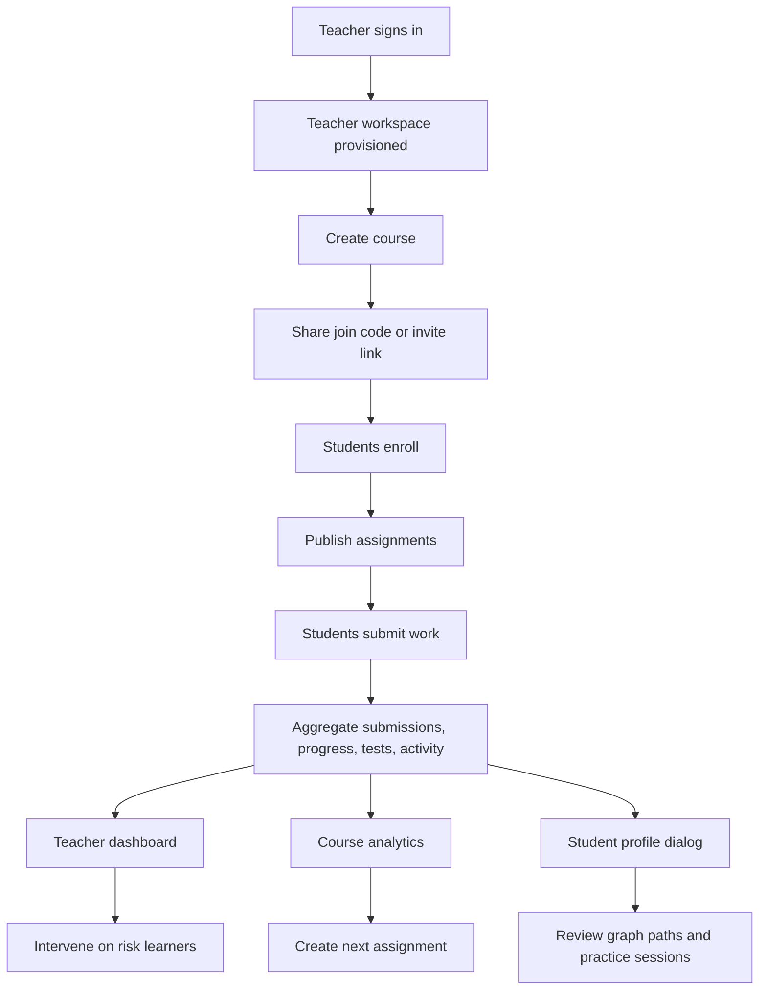

# Brilliant Minds Hub
## Advanced Technical Project Report

Prepared from the local repository on 2026-04-14.

Note: a Claude share link was provided as a visualization reference, but `claude.ai/share` could not be crawled from this environment. The diagrams below were therefore derived directly from the codebase and written in a reusable Mermaid format.

---

## 1. Executive Summary

Brilliant Minds Hub is a dual-portal GATE DA preparation platform that combines:

- a student-facing learning workspace for subject practice, adaptive testing, AI-assisted coaching, progress tracking, notes, assignments, and review
- a teacher-facing command center for classroom creation, join-code based enrollment, assignment publishing, learner monitoring, analytics, and intervention planning
- a shared data backbone in Supabase with strong separation between student performance data and teacher classroom data
- multiple recommendation and decision-support systems, including graph-based adaptive sequencing, remediation-aware retries, rule-based and LLM-backed study coaching, teacher intervention suggestions, and GATE score prediction

The project is not just a question bank website. It is a classroom-aware learning intelligence system that turns student activity into personalized recommendations and teacher analytics.

---

## 2. Product Vision

The project is designed around one core idea:

**Students should not only practice questions; the system should decide what they should solve next, what they should revise, how teachers should intervene, and how the learning journey should be tracked over time.**

This vision is implemented through:

- role-based student and teacher experiences
- subject and topic structured practice
- adaptive next-question selection
- assignment and coursework workflows
- performance telemetry via activity events
- teacher summaries, risk scoring, and class insights
- AI coaching and prediction features
- offline-friendly local caching plus cloud persistence

---

## 3. Platform Scope

### Student Workspace

- Authentication and profile creation
- Classroom enrollment through join codes
- Subject browsing and topic notes
- Topic-wise tests
- Adaptive practice
- Full GATE paper style practice
- Assignment attempts
- History with review answers
- Dashboard analytics
- AI study coach
- Theme and account settings

### Teacher Command Center

- Teacher sign-up and workspace provisioning
- Course creation with join codes
- Enrollment monitoring
- Assignment creation and publishing
- Submission review
- Student-level performance analytics
- Course-level analytics
- Recent activity tracking
- Teacher settings and workspace management

---

## 4. Technology Stack

| Layer | Technologies |
|---|---|
| Frontend | React 18, TypeScript, Vite |
| Routing | React Router |
| UI system | Tailwind CSS, Radix UI, shadcn/ui, Lucide icons |
| Data client | Supabase JS |
| Query/data orchestration | TanStack React Query plus custom hooks |
| Visualization | Recharts in app, Matplotlib/NetworkX/Pandas in notebooks |
| Auth | Supabase Auth with separate teacher/student sessions |
| AI backends | Gemini, Ollama via Supabase Edge Function, deterministic fallback logic |
| Testing | Vitest, Testing Library, Playwright |
| Analysis artifacts | Jupyter notebooks generated from Python scripts |

---

## 5. High-Level Architecture

### Architectural interpretation

- Student learning data is stored primarily in the `public` schema.
- Teacher classroom and coursework management live in the `teacher` schema.
- Teacher analytics intentionally bridge both schemas.
- Recommendation systems are implemented inside the frontend/domain layer, then persisted through Supabase tables and activity events.
- AI coaching is hybrid: deterministic fallback first-class, external LLM optional.

---

## 6. Core Data Architecture

### Public schema

- `profiles`: role, name, email, ELO, streak, theme, last active
- `user_progress`: subject-level performance aggregation
- `answered_questions`: fine-grained correctness logging
- `test_history`: completed practice/test summaries, now including `review_payload`
- `activity_events`: event stream for telemetry, graph sessions, practice session reviews, classroom events

### Teacher schema

- `teachers`: teacher identity records
- `courses`: teacher-owned classrooms with join codes
- `enrollments`: student-course membership
- `assignments`: homework/tests linked to courses
- `submissions`: student answers, scores, correctness totals, violations

### Access model

- Student and teacher sessions are distinct.
- RLS policies gate who can read or mutate rows.
- Teachers can read public student data only for students in their classrooms.
- Students can only see their own classroom relationships and submissions.

### Provisioning behavior

The `handle_new_user` trigger:

- inserts or updates a `profiles` record
- creates teacher identity and a default teacher course for teacher sign-ups
- optionally auto-enrolls a student into a course when a join code is present at signup time

---

## 7. Major Functional Modules

### 7.1 Authentication and Identity

The project supports:

- student sign-up and sign-in
- teacher sign-up and sign-in
- profile auto-provisioning
- session restoration
- fallback auth endpoint handling when direct fetches fail

### 7.2 Classroom System

The classroom model supports:

- course creation
- join-code extraction and normalization
- invite link generation
- multi-course student enrollment
- course removal
- teacher-side student removal

### 7.3 Practice and Assessment System

The practice module supports three main modes:

- full mock / full GATE paper mode
- topic-wise test mode
- adaptive test mode

Additional practice-linked features:

- answer capture
- review mode
- rapid guess detection
- ELO adjustments
- session review persistence
- history replay

### 7.4 Assignment System

Teachers can publish coursework using:

- subject selection
- optional topic filtering
- difficulty selection
- question count
- timer
- due dates
- manual quiz or bank-driven question sets

Students can:

- attempt assignments
- submit answers
- receive scores and correctness evaluation

### 7.5 Analytics and Monitoring

The analytics layer computes:

- student summaries
- course summaries
- completion rates
- average accuracy
- weak topics
- recent activity streams
- recommendation graph sessions
- review sessions
- suggested interventions

---

## 8. Recommendation Systems Portfolio

This project contains multiple recommendation-style engines, not just one.

| Engine | Purpose | Main Inputs | Main Output |
|---|---|---|---|
| Adaptive next-best question engine | Choose the next practice question | ELO, session attempts, graph neighbors, topic stats | next question + explanation metadata |
| Remediation path engine | Recover from misses | incorrect attempt history, graph hops, remediation progress | easier or related follow-up path |
| Retry recommender | Decide when to re-serve the original missed question | remediation steps completed + remediation accuracy | retry of prior missed node |
| AI study coach | Recommend plans, priorities, strategies | subject performance, weak areas, recent tests, streak, ELO | coaching summary and next actions |
| Teacher intervention recommender | Suggest class actions | class weak topics, course accuracy, completion rates | suggested assignments + focus students |
| GATE score prediction engine | Estimate future exam band | ELO, completion, overall accuracy, subject consistency | min/expected/max score band |
| Practice review / rapid-guess engine | Penalize suspiciously fast solves and surface warnings | time spent, question length, question type, ELO | warning text + ELO adjustment |

---

## 9. Adaptive Recommendation Engine

### 9.1 Purpose

The adaptive engine does not simply pick a random question near a user's level. It combines:

- graph structure
- topic continuity
- ELO targeting
- momentum detection
- reward signals
- remediation tracking
- retry logic

### 9.2 Core inputs

- `subjectId`
- `studentElo`
- `topicId` or topic constraint
- answered question set
- current session question set
- session attempt history
- question graph
- hop limit

### 9.3 Recommendation graph design

The engine builds a graph over the question bank using:

- subject membership
- topic membership
- difficulty ordering
- ELO adjacency
- question type similarity
- mark similarity
- subject anchors and topic anchors

Edges are typed as:

- `same-topic`
- `subject-flow`
- `subject-bridge`

### 9.4 Core policy logic

The engine computes:

- session momentum: `hot`, `steady`, or `cold`
- recent reward signal
- target ELO
- target difficulty
- focus topic
- remediation target if a miss remains unresolved

Current target difficulty mapping:

- ELO < 1300 -> easy
- 1300 to <1500 -> medium
- 1500+ -> hard

### 9.5 Momentum behavior

- `hot` if recent correctness streak and reward signal are strong
- `cold` if recent misses or negative reward dominate
- `steady` otherwise

This momentum influences:

- target ELO shift
- hop preference in the graph
- difficulty stretch or recovery

### 9.6 Remediation behavior

If the learner misses a question:

- the engine identifies an unresolved target
- it looks for same-topic or nearby graph neighbors
- it prioritizes recovery-oriented steps
- it tracks remediation attempts
- it retries the original missed question after enough successful follow-up work

Current retry eligibility requires:

- completed remediation steps at or above hop limit
- remediation accuracy at or above a threshold

### 9.7 Candidate scoring

Candidate questions are ranked using a heuristic combining:

- distance from target ELO
- difficulty gap
- topic weakness
- recency of topic exposure
- last attempt correctness
- remediation context
- reward signal
- graph boost from edge weight and neighbor mode

### 9.8 Explainability

The engine returns not only the next question, but also:

- recommendation reasons
- target ELO
- target difficulty
- momentum label
- graph mode
- originating question
- edge weight
- edge kind
- hop distance
- remediation target question id

This is a strong design choice because the recommendation is explainable rather than opaque.

### 9.9 Adaptive engine flow diagram

### 9.10 Why this engine is strong

- It is personalized in-session, not just globally personalized.
- It uses structural graph movement instead of flat difficulty sorting.
- It supports recovery after a wrong answer.
- It logs path metadata so teacher analytics can reconstruct the session.
- It has direct unit tests for remediation, retry, and exclusion rules.

---

## 10. Practice Review and Rapid-Guess Intelligence

The project includes a separate micro-engine for practice review quality.

### 10.1 Purpose

Detect answers that may be technically correct but suspiciously fast, then reduce ELO reward and mark them for review.

### 10.2 Inputs

- question stem length
- option length
- question type
- actual time spent
- question ELO

### 10.3 Outputs

- rapid guess threshold in seconds
- penalty amount
- warning text
- question review metadata

### 10.4 Behavior

- NAT, MSQ, and MCQ use different time thresholds
- faster-than-threshold solves trigger a warning
- penalties scale with severity and ELO

### 10.5 Review pipeline diagram

---

## 11. AI Coach Recommendation System

### 11.1 Purpose

Provide personalized academic guidance rather than generic chatbot replies.

### 11.2 Architecture

The AI coach supports three execution modes:

- Gemini-backed
- Ollama-backed through a Supabase Edge Function proxy
- deterministic fallback

### 11.3 Inputs

- student ELO
- tier
- overall accuracy
- total answered
- streak
- weak topics
- strong topics
- subject performance
- recent tests
- ongoing chat messages and focus area

### 11.4 Outputs

Two main products:

- structured summary insights
- interactive study-coach chat replies with suggested next prompts

### 11.5 Fallback intelligence

The fallback engine is not a placeholder. It contains structured coaching logic for:

- today's starting topic
- 3-day plans
- 7-day plans
- weak area prioritization
- next mock preparation
- study sequencing
- subject allocation

### 11.6 Scope guardrails

The coach is constrained to GATE DA prep.

If the focus area is out of scope, the system redirects the user back to:

- weak areas
- revision plans
- practice strategy
- mock-test improvement

### 11.7 AI coach flow diagram

### 11.8 Why this matters

This makes the coaching layer resilient:

- no external AI required for baseline usefulness
- LLM support improves depth without being a hard dependency
- JSON-oriented prompt design keeps outputs structurally consistent

---

## 12. Teacher Analytics and Intervention Recommendation System

### 12.1 Purpose

Translate classroom telemetry into teacher actions.

### 12.2 Student-level analytics

The teacher analytics layer computes:

- ELO
- accuracy
- questions solved
- joined courses
- weak topics
- assignment completion counts
- completion rate
- average submission accuracy
- risk level

### 12.3 Risk model

Risk is derived from a combined score using:

- overall accuracy
- assignment completion rate
- ELO readiness

Students are categorized as:

- low risk
- medium risk
- high risk

### 12.4 Course-level analytics

Each course summary includes:

- course title
- join code
- student count
- assignment count
- average submission accuracy
- completion rate

### 12.5 Teacher recommendations

The teacher insight engine proposes:

- class weak topics
- suggested assignments
- focus students
- top performers

This means the teacher portal is not only descriptive but prescriptive.

### 12.6 Teacher analytics pipeline diagram

---

## 13. GATE Score Prediction Engine

### 13.1 Role in the system

The score prediction module acts as a motivational and strategic estimator for students.

### 13.2 Current implemented gating logic

The currently implemented component unlocks only when the student reaches:

- ELO >= 2500
- full mock completion >= 70%
- topic-wise completion >= 70%
- adaptive completion >= 70%

### 13.3 Prediction model

The score estimate is based on weighted factors:

- current accuracy
- normalized ELO
- subject consistency
- improvement factor

The output includes:

- minimum expected score
- expected score
- maximum expected score
- confidence
- recommendation text

### 13.4 Important implementation note

The repository includes `GATE_SCORE_PREDICTION_GUIDE.md`, which describes an earlier design with different unlock conditions. The live code in `GateScorePrediction.tsx` is stricter and completion-based. Any formal project presentation should reference the implemented code, not only the older guide.

### 13.5 Score prediction flow diagram

---

## 14. Student Learning Journey

### Journey interpretation

The system does not separate practice from analytics. Each action becomes a learning signal that feeds future recommendations, dashboards, and teacher visibility.

---

## 15. Teacher Operational Journey

---

## 16. Persistence, Sync, and Telemetry

### Local state

The student context caches:

- ELO
- answered question ids
- subject score aggregates

This improves responsiveness and continuity across sessions.

### Cloud state

The cloud layer persists:

- profile data
- subject progress
- answered question correctness
- tests
- assignment submissions
- activity events

### Telemetry model

Activity events are a major design asset in this project. They capture:

- sign-up / sign-in / sign-out
- course joins and leaves
- question answers
- test completions
- graph path completions
- practice session completions
- teacher course and assignment operations

This event stream powers:

- teacher activity feeds
- graph session analysis
- practice review history
- downstream notebooks

### Shared-project strategy

The project is now designed for one Supabase project with:

- `public` schema for student/performance data
- `teacher` schema for classroom operations

The older `teacher-sync` edge function is only a compatibility path for split-project setups.

---

## 17. Review Answers and Historical Reconstruction

The history system now supports attempt review through stored review payloads.

### Stored review information

- question ids
- submitted answers
- optional question review metadata
- full test identifiers where relevant

### Why this matters

This change makes historical sessions replayable rather than just score summaries.

It also aligns the platform with a more serious exam-prep product, because students can:

- inspect wrong answers
- revisit explanations
- compare submitted vs correct responses
- review timing and rapid-guess warnings

---

## 18. Research and Visualization Assets

The repository contains research-oriented notebook generators that extend the product beyond the live UI.

### 18.1 Question Graph Analysis Notebook

The generated notebook:

- exports the full question bank
- deduplicates question instances
- builds a graph from all project questions
- uses NetworkX, Pandas, NumPy, Matplotlib
- optionally uses TF-IDF similarity
- supports GraphML and JSON export

This gives the project a strong research/analysis layer around the adaptive graph engine.

### 18.2 Student Progress Analytics Notebook

The student progress notebook:

- loads `profiles`, `test_history`, `user_progress`, `answered_questions`, and `activity_events`
- visualizes performance history
- estimates future score, accuracy, and ELO trends
- supports authenticated Supabase querying

### 18.3 Teacher Dashboard Mockup Generator

The repo also includes tooling to generate teacher dashboard mockups, which shows design-system maturity and presentational planning.

---

## 19. Testing and Validation Signals

The project includes automated validation through:

- `vitest`
- React Testing Library
- Playwright

The adaptive engine has direct tests for:

- simpler follow-up after a miss
- remediation path construction
- harder neighbor after a correct answer
- retrying a previously missed question after sufficient remediation
- never resurfacing already answered or already served questions

This is especially important because the adaptive logic is the intellectual center of the project.

---

## 20. Project Strengths

### Product strengths

- dual-portal design with meaningful role separation
- classroom-aware learning flow
- historical review support
- explainable recommendations
- teacher intervention tooling
- hybrid AI architecture with offline-safe fallback behavior

### Technical strengths

- strong domain modeling
- explicit RLS-backed schema design
- reusable analytics builders
- real-time teacher workspace refresh flow
- event-driven observability
- notebook-backed research assets

### Recommendation-system strengths

- graph-based sequencing instead of naive randomization
- remediation-aware learning recovery
- retry logic tied to demonstrated progress
- timing-aware reward trimming
- teacher-facing interpretation of student paths

---

## 21. Limitations and Improvement Opportunities

### Current opportunities

- introduce explicit versioning for recommendation experiments
- persist more model diagnostics for later analysis
- extend notebook outputs into first-class dashboard surfaces
- add recommendation performance evaluation metrics
- create a formal experiment dashboard for comparing policy variants
- add richer prediction-history storage for the score prediction feature

### Documentation opportunity

Some internal guides document earlier designs. The codebase would benefit from a synchronized architecture document and algorithm catalog so presentations, guides, and implementation remain aligned.

---

## 22. Suggested Future Roadmap

### Recommendation systems

- multi-objective recommendation balancing mastery, speed, and retention
- spaced repetition signals for previously learned topics
- explicit prerequisite graph modeling
- teacher-controlled recommendation policies per course
- cohort-aware recommendations based on class difficulty trends

### Analytics

- longitudinal ELO trend charts in-app
- concept drift detection
- early-warning prediction for assignment non-completion
- graph-path clustering by learner type

### AI and personalization

- prompt-grounded coach responses with topic references
- automatic weekly study-plan generation from telemetry
- assignment difficulty auto-tuning from classroom outcomes
- explainable intervention summaries for teachers

---

## 23. Key Files and Their Roles

| File | Role |
|---|---|
| `src/App.tsx` | route map for the entire product |
| `src/contexts/StudentAuthContext.tsx` | student identity, ELO, progress, history persistence |
| `src/lib/nextBestQuestionEngine.ts` | adaptive graph recommendation engine |
| `src/lib/practiceReview.ts` | rapid-guess detection and ELO trimming |
| `src/lib/aiCoach.ts` | AI coach insight and chat generation |
| `src/lib/teacherAnalytics.ts` | teacher summaries, risk scoring, intervention insights |
| `src/lib/classroom.ts` | classroom domain model and grading helpers |
| `src/lib/classroomData.ts` | teacher workspace aggregation and classroom operations |
| `src/lib/activityEvents.ts` | telemetry event logging |
| `src/components/GateScorePrediction.tsx` | prediction feature UI and scoring logic |
| `src/pages/PracticePage.tsx` | main practice and review flows |
| `src/pages/TestHistoryPage.tsx` | historical session review |
| `supabase/migrations/20260408103000_single_project_teacher_schema.sql` | shared-project teacher schema design |
| `tools/generate_gate_da_question_graph_notebook.py` | graph analysis notebook generator |
| `tools/generate_gate_da_student_progress_notebook.py` | student progress analytics notebook generator |

---

## 24. Final Assessment

Brilliant Minds Hub is best understood as a **personalized learning and classroom intelligence platform for GATE DA**, not merely a test-prep frontend.

Its strongest distinguishing features are:

- graph-driven adaptive sequencing
- remediation and retry intelligence
- hybrid AI coaching
- teacher-facing intervention analytics
- a shared telemetry backbone connecting student behavior to teacher insight

From a project-report perspective, this is a substantial academic and engineering system because it combines:

- product design
- recommender-system design
- analytics engineering
- role-based data architecture
- AI-assisted guidance
- explainable educational decision logic

If you present this project formally, the strongest framing is:

**"An explainable, classroom-aware, multi-engine recommendation platform for GATE DA preparation."**

